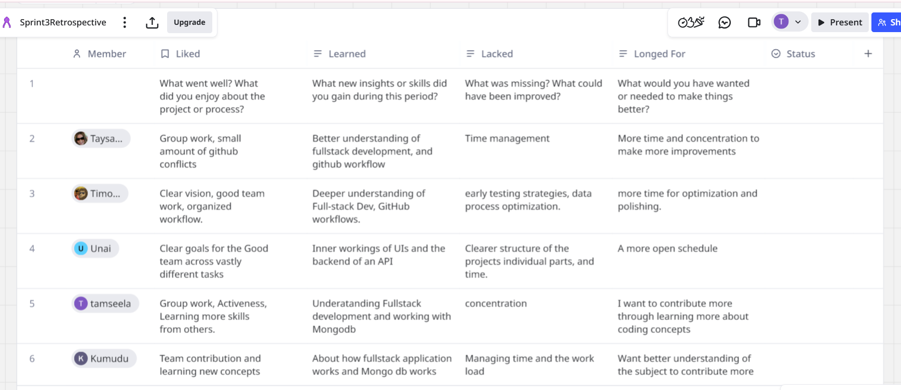

# Project Deliverables

## 1. Source Code (Front-End & Back-End)

- [JOBAio Repository](https://github.com/Lion504/JobAio)

---

## 2. Scrum Ceremony Insights

### Daily Scrum

- Attendance was consistent, and updates were concise instead of drifting into long discussions.
- For sprint 3 the team communicate and collaborated effectively.
- Addressed the time managemnet issue and worked on improving them.

### Sprint Review

- Team remained highly active and gave frequent feedbacks for improvements, resulting in speedily improvements.
- For instant we have better search engine functionality or more optimized job scarapping to database entry flow.

### Sprint Retrospective

Discussed all 4L related question for retrospective and identified where we want to improve, we have written thought here in miro, details in the screenshot.

---

## 3. Team Contributions

| Team Member  | Repository Link                                                                                                                                                                                                                                                                                                                                                                                                                                                                                                                                                                                                                                                                                                                                                                                                        |
| ------------ | ---------------------------------------------------------------------------------------------------------------------------------------------------------------------------------------------------------------------------------------------------------------------------------------------------------------------------------------------------------------------------------------------------------------------------------------------------------------------------------------------------------------------------------------------------------------------------------------------------------------------------------------------------------------------------------------------------------------------------------------------------------------------------------------------------------------------- |
| **Taysa**    | [Taysa's Working Repository](https://github.com/Lion504/JobAio/tree/feature/search-engine)                                                                                                                                                                                                                                                                                                                                                                                                                                                                                                                                                                                                                                                                                                                             |
| **Tamseela** | [Tamseela's Working Branch](https://github.com/Lion504/JobAio/tree/feature/backend)                                                                                                                                                                                                                                                                                                                                                                                                                                                                                                                                                                                                                                                                                                                                    |
| **Unai**     | —                                                                                                                                                                                                                                                                                                                                                                                                                                                                                                                                                                                                                                                                                                                                                                                                                      |
| **Kumudu**   | [Kumudu's Working Branch](https://github.com/Lion504/JobAio/tree/feature/backend)                                                                                                                                                                                                                                                                                                                                                                                                                                                                                                                                                                                                                                                                                                                                      |
| **Wang**     | - [feature/backend](https://github.com/Lion504/JobAio/tree/feature/backend) - [feature/translator](https://github.com/Lion504/JobAio/tree/feature/translator) - [feature/semantic-search](https://github.com/Lion504/JobAio/tree/feature/semantic-search) - [feature/2ndjobs](https://github.com/Lion504/JobAio/tree/feature/2ndjobs) - [feature/job-categorization-embeddings](https://github.com/Lion504/JobAio/tree/feature/job-categorization-embeddings) - [feature/scraper-translate-pipeline](https://github.com/Lion504/JobAio/tree/feature/scraper-translate-pipeline) - [feature/ai-job-description-analyzer](https://github.com/Lion504/JobAio/tree/feature/ai-job-description-analyzer) - [feature/job-scraper-core](https://github.com/Lion504/JobAio/tree/feature/job-scraper-core) |

---

## 4. Presentation

### Link for Presentation Slides

- [Figma Slides](https://www.figma.com/deck/uYQ2TvR9ZGoRywVv2XeDCV/JOBAio-Sprint-3?node-id=1-704&t=neiHglsPqCXTjGUQ-1)

---

## 5. Self-Assessments (Front-End + Back-End)

| Team Member  | Self-assessment Link                                                            |
| ------------ | ------------------------------------------------------------------------------- |
| **Taysa**    | [Taysa's self-assessment](./self_assessments/self_assessment_taysa.md)          |
| **Tamseela** | [Tamseela's self-assessment](documentation/self_assessments/Tamseela.md)        |
| **Unai**     | —                                                                               |
| **Kumudu**   | [Kumudu's self-assessment](./self_assessments/self_assessment_Kumudu.md)        |
| **Wang**     | [Wang's self-asessment](documentation\self_assessments\self_assessment_Wang.md) |

## 6 Self-grading

| **Criteria**                      | **Points**     |
| --------------------------------- | -------------- |
| Artifacts of Sprint 2             | 50 Points      |
| Adherence to Scrum Process        | 25 Points      |
| Group Presentation                | 25 Points      |
| Alignment with Sprint 1 Prototype | 25 Points      |
| **Total**                         | **100 Points** |
